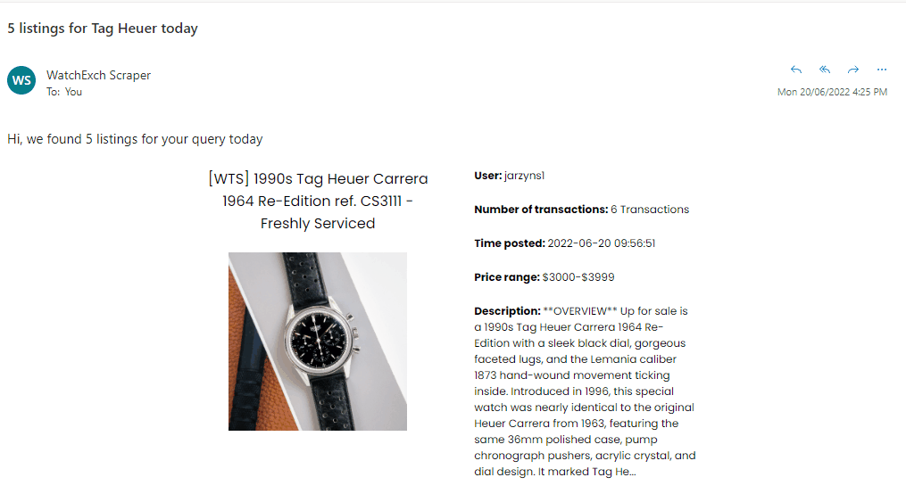

# Reddit-Watchexch-Scraper

Simple scraper made with the Flask framework that finds listings for a particular query each day and sends an email at a specific time with a short description of each listing.

Example email



# Technologies used

[Celery](https://github.com/celery/celery) and [RedisBeat](https://github.com/liuliqiang/redisbeat) - To create a task schedule with crontab to execute at a particular time each day.

[Python Reddit API Wrapper (PRAW)](https://praw.readthedocs.io/en/stable/) - To find listings for a specified query.

[Mailgun API](https://mailgun.com) - To send emails.

[MongoDB as PyMongo](https://pymongo.readthedocs.io/en/stable/) - To keep track of user information such as saved queries, scheduled time.

[Flask](https://flask.palletsprojects.com/en/2.1.x/) - Web framework for the website.

# Installation

1. Clone repository
2. Configure .env file with env.sample

   (Optional) - configure settings.json with your gmail email and app password if you want to use gmail instead of mailgun. Use send_email_handler instead of send_email_mailgun in scraper.py

3. Install libraries in requirements.txt
4. Install redis

# Starting up project

```python
Start up redis server in redis directory

#Start these commands in the current directory where main.py is located
#Start worker
celery -A lib.tasks.celery worker -l info

#Start beat in separate terminal
celery -A lib.tasks.celery beat -S redisbeat.RedisScheduler --loglevel=debug

# Start flask in separate terminal
flask run
```

